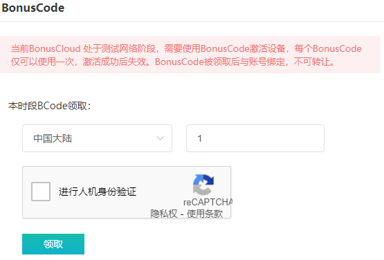

# 加入步骤
 

## 1. 前往BonusCloud官网注册账号
### -> [注册链接](https://console.bonuscloud.work/signUp)
### -> [视频教程](https://v.qq.com/x/page/h0812vmy14j.html)
 

## 2. 获取BCode (激活码)
### 注册后登录后台，到数据面板处领取，如图所示  
  
- **每个账号 每小时 可以领取 10 个**  
- **每个账号 每天 最多领取 100 个**  
- **若账号中已有绑定设备，则 未使用 的 BCode 有效期为 20 天**  
- **若账号无绑定设备，则 未使用 的 BCode 有效期为 10 天**  
- **BCode (激活码) 分为以下三类，请根据实际情况选择：**  
  - 中国大陆  
  - 中国大陆 - 计算任务专用  
  - 非中国大陆  
### 不清楚如何选择 BCode的，可访问：
### -> [常见问题 - BCode类型](6.1-faq-bcode.md)
 

## 3. 选择任务，设备并获取收益
### 可根据自己的实际情况选择任务类型和对应的设备：
### -> [任务类型](3.0.0-task.md)
### 不明白设备如何刷机的朋友，可以直接前往官方合作渠道购买已经刷好的设备（非专用设备）：
### -> [官方合作设备渠道](2.1-store.md)
 

## 4. 收益兑换和提现
### ->  [提取收益](5.0-withdrawal.md)
### ->  [常见问题 - 提取收益](6.4-faq-withdrawal.md)
