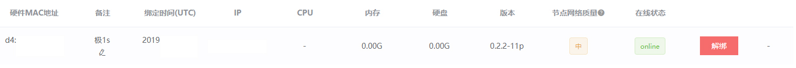
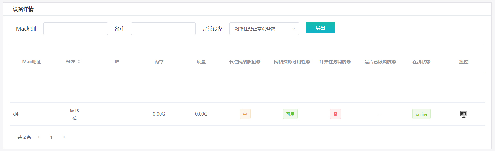

# 轻节点 - 网络任务 接入细则

## 条件要求
### ● 支持中国大陆和非中国大陆 
### ● 需要独立公网IP
### ● 无需外接任何存储设备 
### ● 设备24小时稳定在线
### ● 确保网络较为通畅，没有严重的掉线，延迟，丢包等情况
 

## 接入流程
### 1. 从支持设备列表中选择一个：
**-> [路由器](3.1.1-router.md)  
-> [开发板类设备 (基于ARM架构处理器) 或 电脑或服务器 (基于x86-x64架构处理器)](3.1.2-arm-x86.md)**  

### 2. 绑定设备
### 2.1 路由器
> **前往路由器后台管理页，输入账户邮箱地址及BCode绑定即可**  

### 2.2 开发板类设备 或 x86-x64设备
> **除非有特殊说明，开发板类设备或x86-x64设备的大部分镜像不支持登录**  

**-> [绑定设备](4.0-bound.md)  
-> [常见问题 - 设备绑定](6.2-faq-bound.md)**  

### 3. 查看后台
> **关注节点网络质量和在线状态即可，无需关注计算任务调度相关内容** 

**-> [我的硬件](https://console.bonuscloud.work/hardList)**  
  
**-> [设备总览](https://console.bonuscloud.work/deviceOverview)**  
  
 

## 获取 并 提取 收益
### -> [提取收益](5.0-withdrawal.md)
### -> [常见问题 - 提取收益](6.4-faq-withdrawal.md)
 

## 常见问题
### -> [常见问题 - 轻节点 - 网络任务](6.5-faq-net.md)
