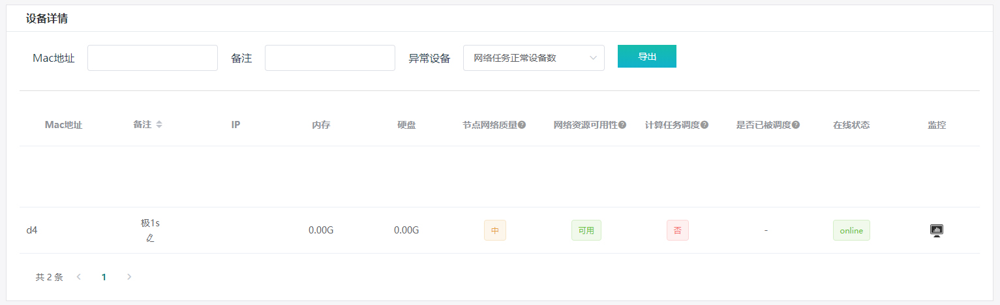

# 轻节点 - 计算任务 接入细则
 

## 条件要求
### ● 仅支持中国大陆三大运营商 (中国电信，中国联通，中国移动)
### ● 需要额外不少于 100 GB 的存储空间
### ● 不要求公网IP
### ● 不支持路由器
 

## 接入流程
### 1. 从支持设备列表中选择一个：
**-> [开发板类设备 (基于ARM架构处理器)](3.2.1-arm.md)  
-> [电脑或服务器 (基于x86-x64架构处理器)](3.2.2-x86.md)**

### 2. 绑定设备
> **除非有特殊说明，开发板类设备或x86-x64设备的大部分镜像不支持登录**  

**-> [绑定设备](4.0-bound.md)  
-> [常见问题 - 设备绑定](6.1-faq-bound.md)**

### 3. 查看后台
> **设备绑定后，网络环境正常且在中国大陆境内，设备信息会逐步上报。需时 20 - 40 分钟不等**  

**->[我的硬件](https://console.bonuscloud.work/hardList)**  
  
**->[设备总览](https://console.bonuscloud.work/deviceOverview)**  
  

### 4. 选择任务
**请保持设备稳定在线，网络通畅。  
● 选择任务或删除任务后，会进入任务切换状态，整个过程需要2小时，请耐心等待切换结束后再进行下一步操作  
● 选择切换任务时，系统会根据所选择设备的硬件配置，给出可以选择的任务类型  
● 请勿频繁操作切换任务类型，可能会导致设备无法正常工作  
● 进行任务切换会导致硬盘现有数据丢失，需要重新进行数据同步  
● 不论设备运行何种任务，不同设备的数据盘互换会导致硬盘数据被清空，需要重新进行同步**  
#### 各设备可选任务列表及配置要求
**-> [任务选择 - 64位 开发板类设备 (基于 ARMv8 架构处理器，N1，我家云 / 粒子云 / 贝壳云 等)](3.2.3-armv8.md)  
-> [任务选择 - 64 位 电脑或服务器 (基于 x86-x64 架构处理器)](3.2.4-x86-x64.md)  
-> [任务选择 - 32 位 开发板类设备 (基于 ARMv7 架构处理器，玩客云等)](3.2.5-armv7.md)**  
 

## 获取 并 提取 收益
### -> [提取收益](5.0-withdrawal.md)
### -> [常见问题 - 提取收益](6.4-faq-withdrawal.md)
 

## 常见问题
### -> [常见问题 - 轻节点 - 计算任务](6.6-faq-cal.md)
