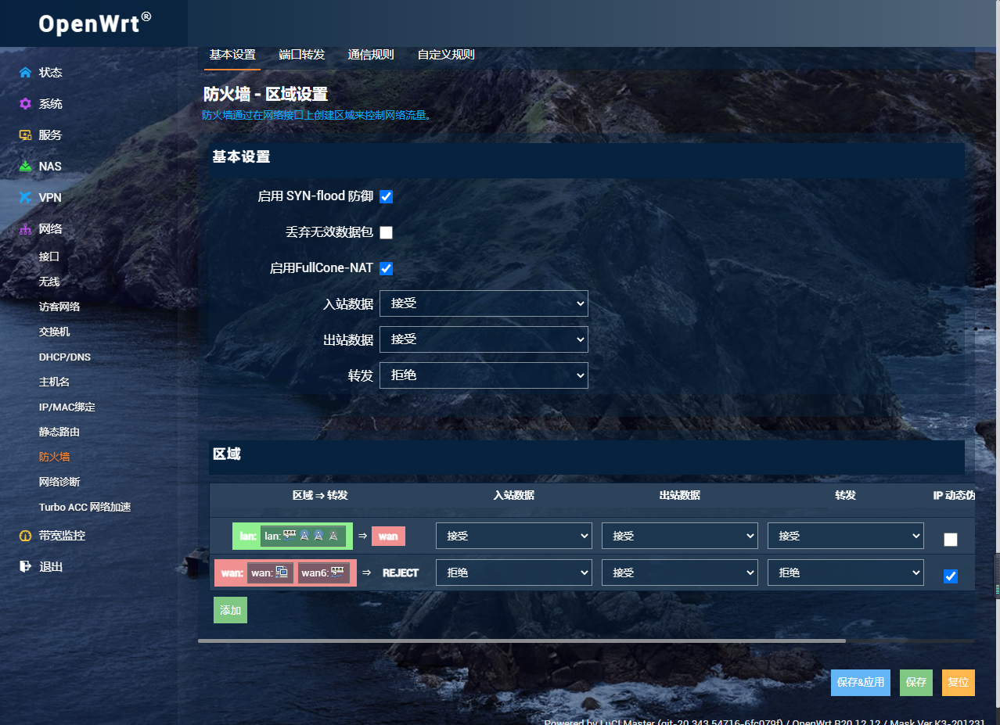
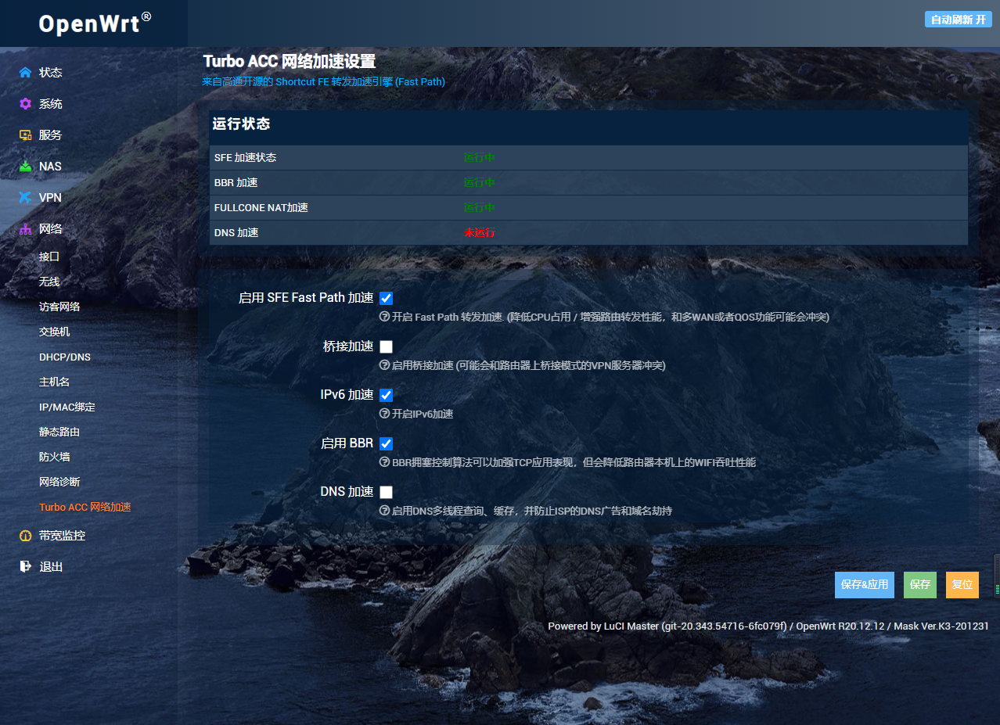
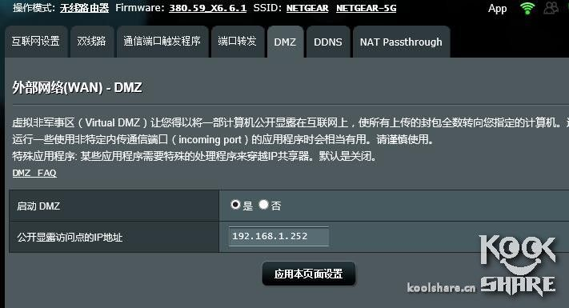
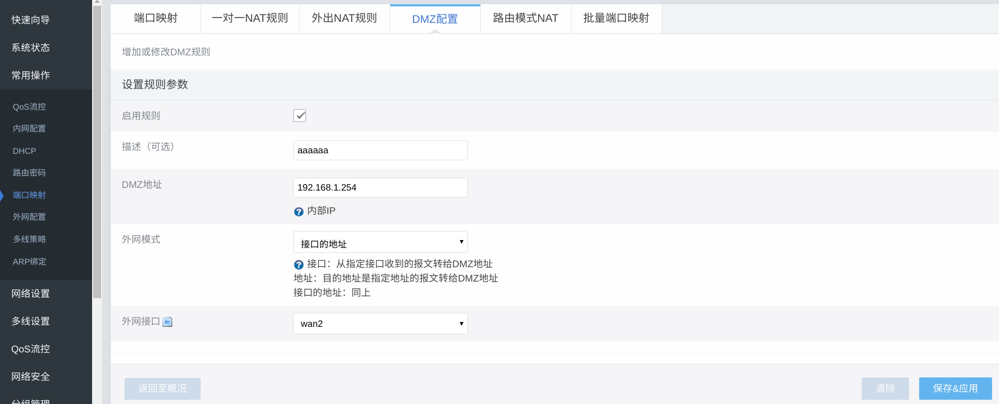
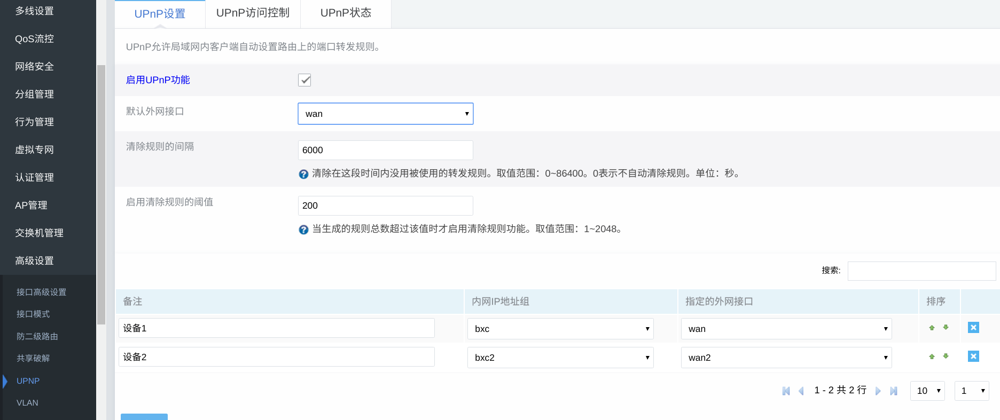
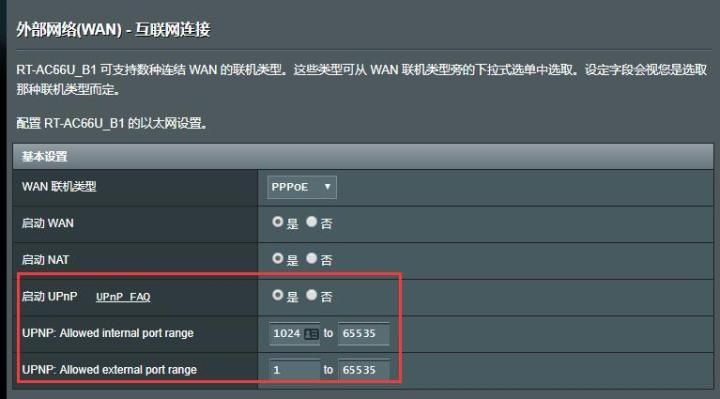

# 常见问题 - 网络穿透
<br>

- ### 网络穿透信息 每三小时 检测一次，如果有变化会自动上报更新
- ### NAT1 和 UPNP 二选一即可，即：
    - **NAT类型为 NAT1 时，可以关闭 UPNP ，且无需关注 UPNP 状态**  
    - **UPNP 显示 开启 时，无需关注 NAT类型**   
- ### DMZ 和 UPNP 在 光猫拨号 模式下可能会存在开启后没有改变的问题   
- ### 在 没有 公网IP 且 光猫桥接 路由器拨号 并 开启 NAT1 或 DMZ 后，最终能否 NAT1 取决于运营商是否支持 NAT1  
- ### 建议使用 爱快、OpenWrt 等比较主流的路由器固件以获得更好的网络环境，不建议使用 ROS  
<br>

## NAT类型
### NAT类型介绍
| 推荐排序 | 英文名称 | 序号 |  中文名称 |
| :----: | :----:| :----: | :----: |
|   | Blocked | 1 | 拒绝 |
| 1 | Open Internet | 2 | 开放型 |
| 2 | Full Cone | 3 | 完全锥形（NAT1） |
|   | Symmetric UDP Firewall | 4 | 对称UDP防火墙 |
| 3 | Restric NAT | 5 | 受限型 （NAT2）|
| 4 | Restric Port NAT | 6 | 端口受限型 （NAT3）|
| 5 | Symmetric NAT| 7 | 对称型 （NAT4）|
| 6 | Changed Address Error | 8 | 地址变化错误 |
<br>

## 开启完全锥形（FullCone，NAT1）方法
### 1. OpenWrt (支持 NAT1)
> ### 目前国内论坛分享的大部分 OpenWrt固件 均带有 Turbo ACC 网络加速 或内核原生支持 FullCone NAT，因此只要保证以下选项打开即可
#### 网络 - 防火墙：勾选 启用FullCone-NAT  
  
#### 网络 - Turbo ACC 网络加速：FULLCONE NAT加速 运行中  
  

### 2. OpenWrt (不支持 NAT1)
> ### 部分固件内核版本较低，防火墙不支持 FullCone NAT，可以通过开启 DMZ 解决
```bash
// SSH中执行
vi /etc/config/firewall

// 在打开的文件中加入
config redirect
        option src              wan
        option proto            all
        option dest_ip          192.168.1.2 # 将IP地址替换为设备的IP地址
```
#### -> [其他方法](https://www.right.com.cn/forum/thread-319827-1-1.html)

### 3. Padavan (老毛子)
**● 高级设置 → 防火墙 → Netfilter  
● 把 NAT 类型 (仅UDP) 改成 Full Cone NAT  
● 应用本页设置**  

### 4. 华硕固件 / 梅林 (ASUSWRT / Merlin)
**● 部分 384 或更高 版本固件支持 FullCone (NAT1) ，开启即可  
● 较老版本 或 没有相关设置项的，可开启 DMZ  
● IP地址为你固定的设备的Ip地址**  
  

### 5. 爱快
**● 新版爱快已支持 Full Cone NAT，升级到最新版本后 系统设置 → 基础设置 → 上网模式 → NAT1 → 保存  
● 或 开启 DMZ：[教程](https://www.ikuai8.com/zhic/ymgn/lyym/wlsz/feqs/dmz.html)**  

### 6. 高恪
**● 硬路由：目前仅 新路由3 破解版 或 授权版支持，其余设备不被支持  
● 软路由：目前仅 ISP3000 版本支持，其余版本不支持  
● DMZ 开启方法：常用操作-端口映射-DMZ配置，打勾后添加一条规则,规则如图，ip填写你固定的设备的ip**  
  

### 7. TP-LINK
### -> [教程地址](https://service.tp-link.com.cn/detail_article_2442.html)

### 8. 其他路由
### 建议开启 DMZ 功能，在有的系统中称为 非军事区
<br>

## UPnP
### 1. 爱快
### -> [教程地址](https://www.ikuai8.com/zhic/ymgn/lyym/wlsz/upnp.html)

### 2. 高恪
### 指定的外网接口wan (有公网Ip才能有好的效果)  
  

### 3. Padavan (老毛子)
**● 高级设置 → 外部网路（WAN）→ 端口转发（UPnP）→ 启用 IGD UPnP  
● 应用本页设置**  

### 4. 华硕固件 / 梅林 (ASUSWRT / Merlin)
**● 外部网络 → 互联网连接**  
  

### 5. TP-LINK
### -> [教程地址](https://service.tp-link.com.cn/detail_article_2936.html)
