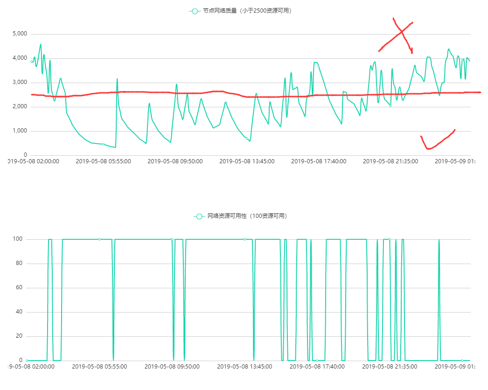

# 常见问题 - 轻节点 - 网络任务
 

## Q1 为什么我的设备节点网络质量为低/没有收益/收益很差？
**● 如果设备刚刚绑定/刚刚重启/刚刚断网重连，节点网络质量会自动重置到低。保持稳定在线一小时后，如果网络环境正常，节点网络质量会逐渐恢复  
● 如果设备使用的定制固件版本不是最新的，建议更新到最新的13p固件。  
● 网络质量较差导致收益不理想  
● 在设备总览页面，点击对应设备的监控图标查看设备网络质量。如图所示的为网络质量较差的节点 (红线以上表示大于2500，属于节点不可用的状态，需要小于2500以保证节点处于可用状态) ：**  
  
 

## Q2 如何修改定制固件的mac地址？
**在固件WAN口设置中自定义**  
 

## Q3 路由器能不能进行计算任务？插硬盘能增加收益吗？
**● 路由器不能进行计算任务  
● 网络任务不需要存储空间，因此插硬盘对收益没有任何帮助**  
 

## Q4 为什么我的 开发板类 / x86-x64 设备显示 无带宽数据 / 不支持调度 / 不显示硬件信息？
- ### 网络任务无需关注能否调度和有无带宽数据，路由器不显示硬件信息
- ### 中国大陆用户：
  - **开启 IPv6**  
  - **修改DNS为 `223.5.5.5` 和 `223.6.6.6`**  
  - **重启路由器和设备后等待20分钟左右即可**  
- ### 非中国大陆用户：
  - **开启 IPv6**  
  - **硬件信息不会显示，无需理会**  
 

## Q5 我的路由器刷了 OpenWrt 固件之后装不上插件了怎么办？
**目前支持的最高版本为 18.06.1 且不支持 PandoraBox 固件**  
 

## Q6 插件装上了但是运行不了怎么办？
**可能是缺少依赖库导致的，建议使用带插件的 OpenWrt 固件**  
 

## Q7 OpenWrt 插件中网页的恢复证书用不了怎么办？
**此问题暂时无解，可以手动将文件放入相应路径解决**  
