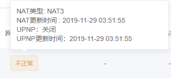

# 常见问题 - 轻节点 - 计算任务
<br>

### ● 收益在北京时间的 15点 后更新
### ● 在北京时间 8点 到 15点 期间，正在进行收益计算，因此不显示收益
<br>

## Q01 为什么设备解绑后依旧在跑数据？如何解绑设备？
- ### 设备需要 断电离线 并且 我的硬件 列表中显示设备离线才可正常解绑设备，设备依然在线时点击解绑是无法解绑的
- ### 设备解绑后，设备中证书会失效，原先选择的任务也会跟随消失
- ### 解绑后设备端需要做以下操作
  - **路由器：恢复出厂设置**  
  - **N1：在 刷机U盘 的 根目录 下添加 `nosave.txt` 文件后重刷**  
  - **我家云 / 粒子云 / 贝壳云：重新刷机**  
  - **x86：格式化系统盘 并 重装系统**
<br>

## Q02 如何 备份 / 还原 证书？
**● 仅 开放版 镜像 支持 备份证书 功能，封闭版 暂不支持  
● 使用 `WinSCP` 登录设备后，备份以下目录的四个文件，还原同理**  
```bash
// 目录：/opt/bcloud
ca.crt
client.crt
client.key
node.db
```
<br>

## Q03 任务中的字母是什么含义，能否混搭，为什么有些任务选不了？
**● 不同的字母代表不同的任务方，是我们内部对不同业务类型做的区分  
● 不同的称呼不会对资源方产生任何影响，根据自己的环境和任务要求，选择匹配的任务运行即可  
● 不同任务间可以混搭，只要保证硬件配置足够运行所选任务即可  
● 部分任务属于定时限量招募或处于调整状态，因此无法选择  
● 硬件配置不可能会导致导致无法选部分任务**  
<br>

## Q04 为什么跑不起来或效果很差，哪个任务效果比较好？
**● 刚绑定的设备硬盘中无可用数据，切换任务后可能会格式化硬盘导致硬盘中无可用数据  
● 硬盘缓存数据被清除后，需要几天的时间来同步数据  
● 目前 移动网络 下 流量单价 相比 电信 和 联通 会低一些，因此同样流量下 移动网络 会比 电信 和 联通 的更低  
● 无法采集到使用带宽数据会导致没有收益  
● 任务是否跑流量取决于业务方。没有跑流量说明该条线路不满足业务方的调度要求，业务方没有调度，可以检查网络环境是否符合要求，以及查看所在地区能否运行  
● 业务方自己有一个调度的级别，分别是高、中、低、差，通常定期检测，评判标准就是看NAT、带宽 、稳定性、出口、IP变化等，不调度说明该条线路的调度级别被业务方评为低或者差了。等下次检测符合他们的稳定性要求了，就会开始重新调度。  
● 博纳云的后台跟业务方自己的后台是两个不同系统。博纳云后台显示正常，但是博纳云通常不检测出口、IP变化频率等方面，业务方会根据自己需求建立调度的标准。  
● 效果取决于很多方面因素，包括但不限于硬件配置，路由器配置，硬盘性能，业务方需求等**  
<br>

## Q05 网络穿透显示不正常？
- ### 网络穿透信息 每三小时 检测一次，如果有变化会自动上报更新
- ### NAT1 和 UPNP 二选一即可，即：
  - **NAT类型为 NAT1 时，可以关闭 UPNP ，且无需关注 UPNP 状态**   
  - **UPNP 显示 开启 时，无需关注 NAT类型**  
- ### DMZ 和 UPNP 在 光猫拨号 模式下可能会存在开启后没有改变的问题
- ### 在 没有 公网IP 且 光猫桥接 路由器拨号 并 开启 NAT1 或 DMZ 后，最终能否 NAT1 取决于运营商是否支持 NAT1
- ### 建议使用 爱快、OpenWrt 等比较主流的路由器固件以获得更好的网络环境，不建议使用 ROS
- ### 刚刚激活的设备需要等待 半小时 到 三小时 不等，等待设备上报信息
- ### 部分固件 UPNP 有问题，例如：高恪会显示UPNP关闭或者内网IP 
- ### 可以将鼠标移动到不正常上，浮窗中会显示 NAT类型，UPNP状态 以及 状态更新时间，如图所示：  
  
<br>

## Q06 CPU、内存、硬盘等硬件信息不显示？
- ### 硬件信息 每三小时 更新一次，每次重启后都会自动检测并更新
- ### 刚刚激活的设备需要等待设备上报信息
- ### 如果三小时后仍然不显示，可从以下方面排除： 
  - **开启 IPv6 并将 DNS地址 改为 `223.5.5.5` 和 `223.6.6.6`**  
  - **如果是脚本安装的，检查 k8s 是否正常运行**  
  - **如果是通过镜像安装的，重新刷写固件或检查固件包的 MD5 是否与下载页提供的 MD5一致**  
- ### 其余信息正常，但是硬盘不显示或突然变为0，可从以下方面排除：
  - **硬盘有问题：包括但不限于硬盘之前被高强度使用或损坏 硬盘供电不足(常见于使用集中供电)**  
  - **● USB口供电坏了(常见于N1等开发板设备)**  
<br>

## Q07 在路由器看见有跑流量，但是没有收益 / 官网 设备总览 处有提示有设备无带宽数据 或 监控没有显示使用带宽？
- ### 这种情况是可能是采集挂了，可以尝试以下方法： 
  - **重启设备**  
  - **开启 IPv6 并将 DNS地址 改为 `223.5.5.5` 和 `223.6.6.6`**  
  - **设备硬件配置不够，升级系统配置**  
  - **前往 [论坛故障反馈](https://bonuscloud.club/viewtopic.php?f=31&t=5389) 处贴上 设备mac地址 和 问题 进行反馈**  
<br>

## Q08 不显示调度状态 / 设备调度失败 / 该设备暂不支持调度？
- ### 调度状态 每两小时 更新一次
- ### 如果是刚刚激活，等待系统自动调度即可
- ### 系统关机或断网后，重新启动后可能会显示调度状态变为调度失败，此时一般等待后台重新调度并且更新调度状态即可
- ### 如果是设备调度失败/该设备暂不支持调度，可以将鼠标移动到旁边的标记查看原因：
  - **请排查DNS解析是否正常：将 DNS地址 改为 `223.5.5.5` 和 `223.6.6.6`**  
  - **自动修复中，等待重新调度：等待即可**  
  - **请将硬盘格式化为EXT4格式：将硬盘插入电脑并用 DiskGenius 格式化为 EXT4，分区表 改为 MBR 后重新接入设备**  
  - **硬盘空间不足：手动格式化硬盘后重试**  
  - **问题待定，请加入交流群联系官方人员：前往 [论坛故障反馈](https://bonuscloud.club/viewtopic.php?f=31&t=5389) 处贴上 设备mac地址 和 问题 进行反馈**  
<br>

## Q09 为什么 同步数据总量 数字变化很慢 / 总是很小？
**● 同步数据总量 每天 更新一次  
● A任务，D任务，F任务 不同步数据 或 数据同步速度很慢 说明 硬盘写入 存在问题，需要检查硬盘是否正常  
● C任务 和 H任务 不同步数据也能跑  
● 对于已经有一定数量缓存的设备而言，每天变化数字不会很大，甚至可能会有变少，这是正常情况**  
<br>

## Q10 我想调整配置 / 换系统，怎么办？
- ### CPU核心数、内存大小：直接调整后等待等待半小时到两小时上报新的信息即可 
- ### 网卡：如果更换后mac地址发生变化，需要重新安装部署绑定 
- ### 数据盘调整： 
  - **物理机或数据盘直通到虚拟机中的：直接更换数据盘即可**  
  - **虚拟机：需要删除原有的数据盘，然后建一个新的数据盘**  
  - **开发板等设备(例如N1)：直接更换即可 按照正确操作更换数据盘后需要等待半小时到两小时上报新的信息**  
- ### 如果需要更换系统，不需要保留证书的，直接更换即可。需要更换系统的，开放版镜像可以自行备份后更换，封闭版镜像需要解绑后重新绑定
<br>

## Q11 我想给N1等设备重新刷机，怎么办？
**● N1：直接将官方镜像写入U盘后，插上U盘再通电，等待系统写入完毕断电拔掉U盘即可，默认状态下证书不会被清除。需要清除证书的，需要在制作好U盘后，打开 `BOOT` 分区，在根目录下新建一个 `nosave.txt` 即可在刷机时清除证书  
● 我家云 / 粒子云 / 贝壳云：刷机时由于会抹除掉整个emmc，因此刷机前需要将设备离线后在官网后台解绑，刷机后才能正常绑定。**  
<br>

## Q12 为什么 N1 / R3300L机顶盒 配机械硬盘只能跑20Mbps左右？
**● 由于 `USB 2.0` 的 `半双工` 工作模式，导致机械硬盘的性能表现弱于在 `USB 3.0` 的` 全双工` 模式，建议更换固态硬盘以获得更好表现。  
● 也可以考虑使用我家云等原生支持 `USB 3.0` 接口的机顶盒搭配固态硬盘。  
● 更多内容可参考：[此处](https://bonuscloud.club/viewtopic.php?f=15&t=6536&p=24033#p24033)**  
<br>

## Q13 什么是内存溢出？
**当出现以下提示内容时，表明 内存不足，需要增加内存。**  
```bash
memory cgroup out of memory
```
